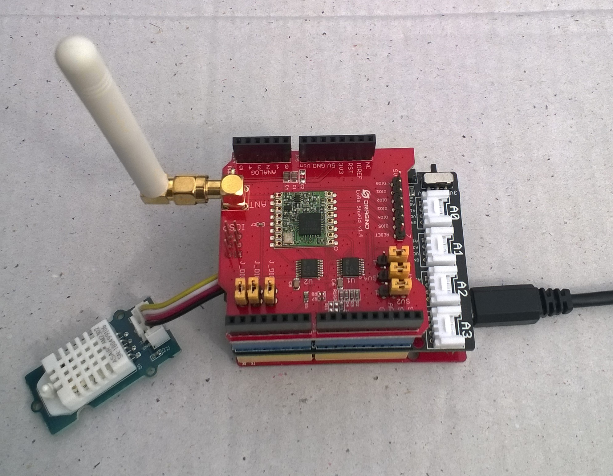

# FieldGateway.LoRa.DuinoClientTemperatureAndHumidity
Sample AM2302 Temperature and humidity monitor duino client for my [Windows 10 IoT Core](https://developer.microsoft.com/en-us/windows/iot) [LoRa](https://lora-alliance.org/) field gateways.

I used the [Arduino-Lora](https://github.com/sandeepmistry/arduino-LoRa), [Grove_Temperature_And_Humidity_Sensor](https://github.com/Seeed-Studio/Grove_Temperature_And_Humidity_Sensor) thank you to Sandeep Mistry and SeeedStudio.

My duinoclient uses

Device options

* [Arduino Uno R3](https://www.seeedstudio.com/Arduino-Uno-Rev3-p-2995.html)
* [Seeeduno V4.2](https://www.seeedstudio.com/Seeeduino-V4-2-p-2517.html)

LoRa shield options tested

* [Dragino 433/868/915Mz](http://www.dragino.com/products/lora/item/102-lora-shield.html)

* [Elecrow 915MHz](https://www.elecrow.com/lora-rfm95-shield-915mhz.html)

* [MakerFabs 433MHz](https://makerfabs.com/index.php?route=product/product&product_id=131)

* [MakerFabs 868MHz](https://makerfabs.com/index.php?route=product/product&product_id=130)

Extras

* [SeeedStudio Grove - Temperature&Humidity Sensor Pro](https://www.seeedstudio.com/Grove-Temperature-Humidity-Sensor-Pro-AM230-p-838.html)

* [SeeedStudio Grove-Base Shield V2](https://www.seeedstudio.com/Base-Shield-V2-p-1378.html)

